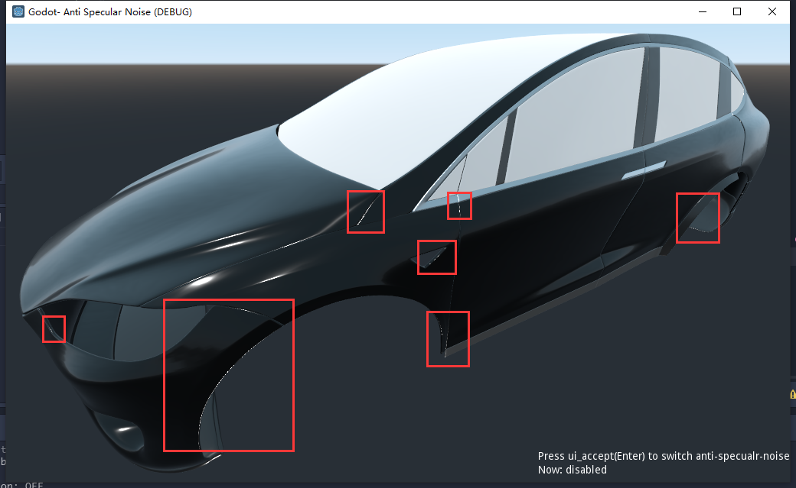
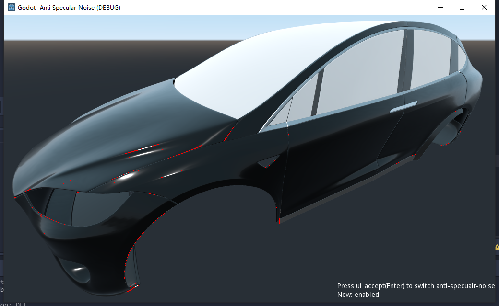

# Godot-AntiSpecularNoise
 
使用Viewport实现后处理。

模型的边缘、折角处有时会充斥白色的小亮点，数量一多就会看起来很杂乱。

我个人管它叫高光噪点。

这些噪点可以使用后处理技术识别出来（孤立亮点判断），并平滑（与相邻点进行均值滤波）。

高金属度、低粗糙度、较黑的材质 再配合highlight属性比较高的灯光节点 更容易出现这种高光噪点。

以下是举例：
 
## Origin 原图:

## Manual-Marked 手动标记:

## Shader-Marked Shader标记:

## Enable-AntiSpecularNoise 启用高光噪声平滑:

